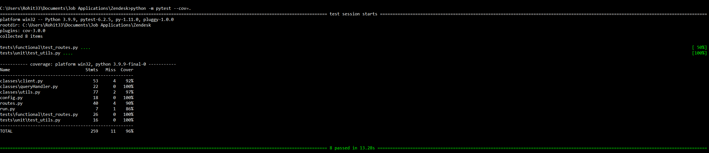

# Ticketing-System 📈
Ticketing system is a dashboard tool for viewing your tickets in the Zendesk system. It uses Zendesk APIs to fetch the data and is built using Python Flask webframework.

## User Stories :dart:
The below user stories are implemented.

:white_check_mark: Display all the tickets for a user account in a list. <br />
:white_check_mark: User can navigate into individual ticket details. <br />
:white_check_mark: Paging through tickets when more than 25 are returned. <br />
:white_check_mark: Error pages are added to handle a scenario where Zendesk APIs are unavailable or if there is a program error. <br />

## Video Walkthrough :clapper:

Here's a walkthrough of implemented user stories:


GIF created with [Snagit GIF Maker](https://www.techsmith.com/learn/tutorials/snagit/animated-gif/).

## Getting Started 💻

### Clone the Repository 

Get started by cloning the project to your local machine:

```
$ https://github.com/Rohit-Badugu/Ticketing-System.git
```

### Installation
```requirements.txt``` file contains a list of all the dependencies. 
1. Install `Python3` using the [documentation](https://www.python.org/downloads/). Set the environmenet variables to Python path.
2. Install `pip` tool using the [documentation](https://pip.pypa.io/en/stable/installation/).
3. Install all the dependencies using `pip`. Run the below command
```
$ pip install -r requirements.txt
```

### Usage
#### Configuration
In `config.py` on line 6, enter the Base64 encoded API KEY value

#### Running the server
1. Navigate to repository directory in the terminal. Run the `run.py` python file using below command
```
$ python run.py
```
2. Once the server has started, you can view the localhost URL. The applciation will start on default URL - `http://127.0.0.1:5000/`
3. Open the above URL in a browser to view the application.

#### Running the tests
1. Python `unittest` module is used for writing the unit tests. Unit tests are placed under directory - `tests/unit`.
2. Python `pytest` module is used for writing the functional tests. Functional tests are placed under directory - `tests/functional`.
3. To start the tests, run the below command in the project repository.
```
$ python -m pytest
```

## Functionality :rocket:
### Pagination
1. The variable `num_tickets_in_page` in `config.py` determines the maximum number of tickets which will be displayed in a page. The default is set to `25`.
2. Zendesk `Offset Pagination` functionality is used for paginating through tickets. The parameters `page` and `per_page` are passed to get the tickets for a particular page.

### Error Handling
1. The application returns HTTP 505: Internal Server Error page in scenario where the Zendesk API endpoint, Authorization issues or program errors. 
2. The application returns HTTP 404: Page Not Found page in scenario where user enters incorrect url in the address bar. 

### Test coverage
Test coverage report is generated using `pytest-cov` library. Link to documentation - 
The unit and functional tests cover `96%` of code. Below is the code coverage summary. <br /><br />


